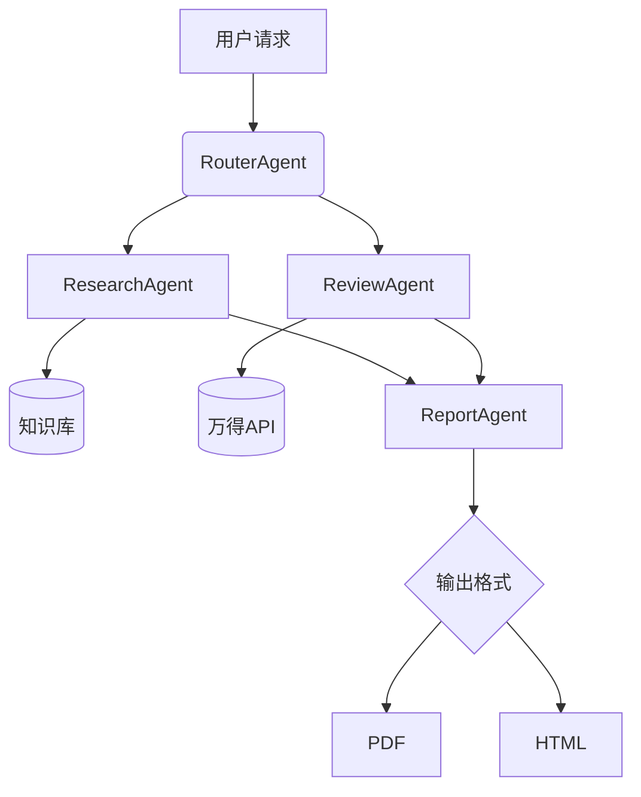

# 金融分析智能体架构设计

## 1. 系统拓扑图

## 2. 核心模块说明
| 模块              | 技术栈                  | 关键特性                     |
|-------------------|-------------------------|----------------------------|
| ResearchAgent     | LangChain, CrewAI       | 行业报告生成/财务分析         |
| Knowledge Base    | ChromaDB, OpenAIEmbed   | 语义检索/动态更新            |
| Evaluation        | LangSmith, Custom Metrics | 实时监控/准确性评估          |